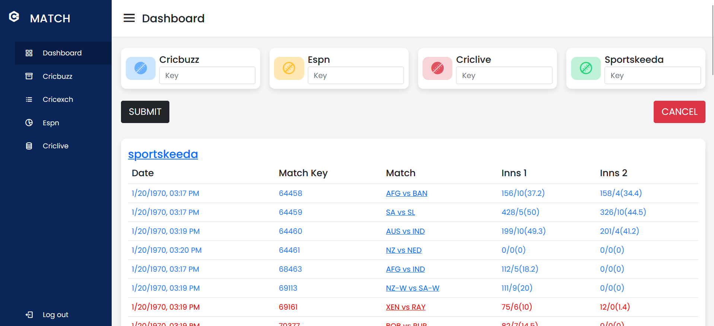

# cricket_panel_frontend
A website where you can see list of all ongoing cricket matches from different sources like cricbuzz, espncricinfo, sportskeeda and nw18.

## Usage
```
npm install
npm start

Go to localhost:3002
```


## Screenshots


